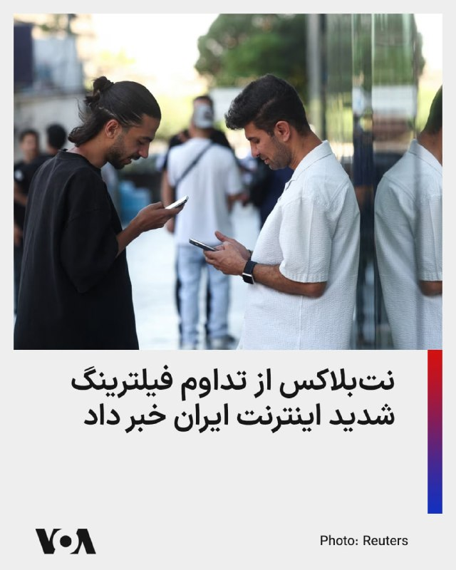
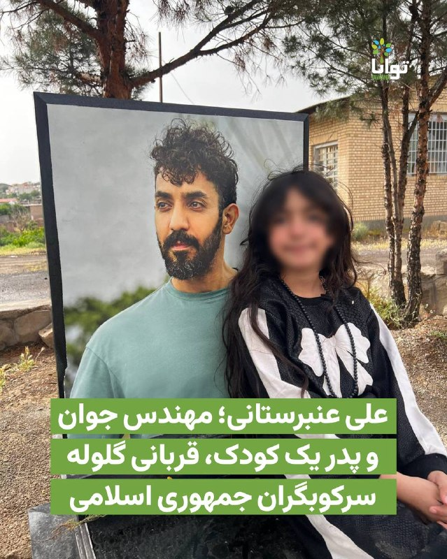
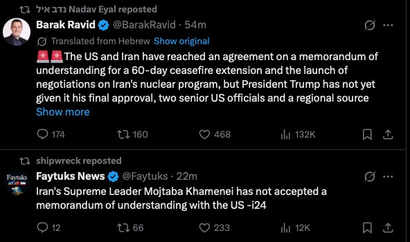
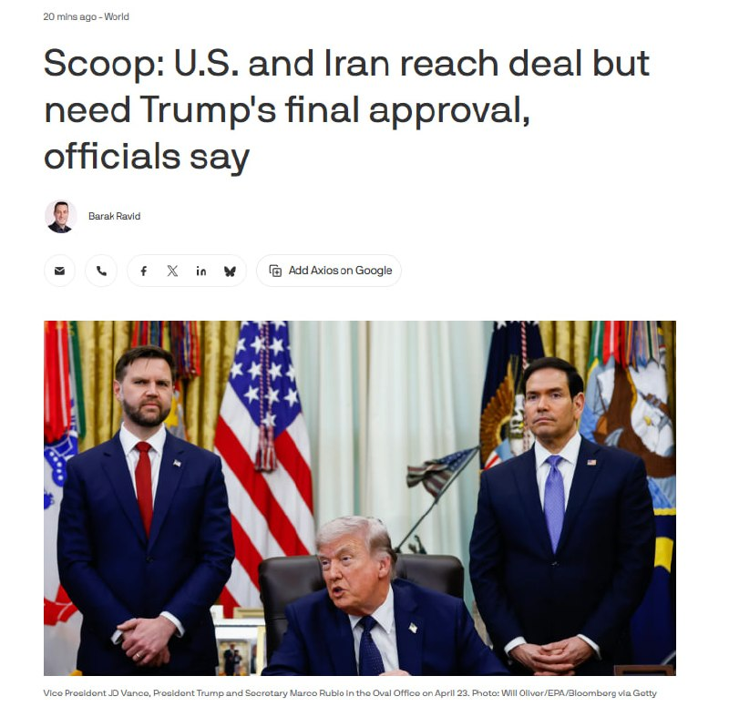
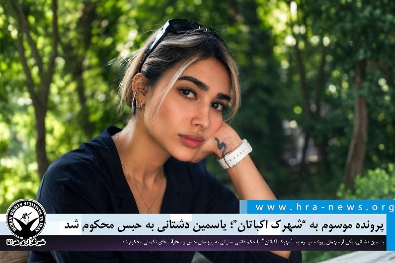

# خواننده تلگرام

<!-- TOP_NAV START -->

<a href="https://github.com/ProAlit/aio-downloader/blob/main/telegram/content/archive_1.md" style="display:inline-block; padding:6px 12px; margin:0 4px; background-color:#2ea44f; color:white; text-decoration:none; border-radius:4px; font-weight:bold;">صفحه بعد</a>

<!-- TOP_NAV END -->

<!-- MSG START -->

---
📅 بروزرسانی: 1405/03/07 18:43
---

## VahidOOnLine — post 242617

⭕️ عضو کمیسیون امنیت ملی مجلس:
اغلب پیشنهادات ایران در مذاکرات پذیرفته شده، اما ترامپ غیر قابل پیش‌بینی است

♦️فداحسین مالکی، عضو کمیسیون امنیت ملی مجلس شورای اسلامی، با اشاره به سفر مارشال عاصم از پاکستان به ایران مدعی شد که اغلب پیشنهادات ایران در روند مذاکرات مورد پذیرش قرار گرفته است.
او گفت: «از نظر کمیت پیشرفت زیادی داشته‌ایم و برخی از خواسته‌های ایران را آمریکایی‌ها باید انجام دهند.»
مالکی همچنین درباره پول‌های بلوکه‌شده ایران گفت که در این زمینه «پاسخ مثبت» دریافت شده است.
این عضو کمیسیون امنیت ملی، «پیش‌بینی‌ناپذیر بودن رفتارهای دونالد ترامپ» را جدی‌ترین مانع در مسیر مذاکرات عنوان کرد.
‌🇸🇦 Indypersian

🤖 @VahidOOnLine

## mwarmonitor — post 9864

🔴اختصاصی آکسیوس: مقامات می‌گویند آمریکا و ایران به توافق رسیده‌اند، اما این توافق نیازمند تأیید نهایی ترامپ است 📝نویسنده: باراک راوید AXIOS 🔰دو مقام آمریکایی و یک منبع منطقه‌ای درگیر در تلاش‌های میانجی‌گرانه به آکسیوس گفتند که مذاکره‌کنندگان آمریکایی و…

## pm_afshaa — post 91742

🔴یک مقام اسرائیلی: رهبر ایران، موش تباه خامنه‌ای، این توافق را تأیید نکرده و به همین دلیل ترامپ نیز آن را تأیید نکرد

💧 Rainbet.com the #1 Non-KYC Crypto Casino & Sportsbook @rainbetcom

😁 @Pm_Afshaa

## pm_afshaa — post 91741

  

یه سری از حکومتیا خبر از کشته شدن جانشین تنگسیری میدن

💧 Rainbet.com the #1 Non-KYC Crypto Casino & Sportsbook @rainbetcom

😁 @Pm_Afshaa

## VahidOnline — post 75770

  

وزارت دادگستری آمریکا اعلام کرد «جاناتان لودهولت»، شهروند آمریکایی ساکن استاتن آیلند، به‌دلیل مشارکت در طرح «تعقیب و قتل» مسیح علی‌نژاد، فعال سیاسی ایرانی-آمریکایی، به ۱۰ سال زندان و سه سال آزادی تحت نظارت محکوم شده است.
@VahidHeadline

📡 @VahidOnline

## VahidOnline — post 75769

  

محمدباقر قالیباف، رییس مجلس، در پیامی به غلامحسین محسنی اژه‌ای، رییس قوه قضاییه جمهوری اسلامی، نوشت: «قوه قضاییه زیر بمباران و تهدید دشمنان دست از صیانت از حقوق مردم و برخورد با قاتلان داخلی و خائنین به ملت نکشید و خوش درخشید.»

پیام قالیباف در حالی منتشر شده که قوه قضاییه طی ۷۰ روز گذشته، حدود ۴۰ زندانی سیاسی را اعدام کرده است.
@VahidOOnLine

📡 @VahidOnline

## VahidOnline — post 75768

  

نت‌بلاکس، نهاد ناظر بر اختلالات اینترنتی، اعلام کرد که علیرغم اینکه دسترسی به شبکه جهانی تا حد زیادی در ایران بازگشته است، اما شاخص‌ها نشان می‌دهند که کاربران همچنان با فیلترینگ شدید مواجه هستند.

نت‌بلاکس، این فیلترینگ شدید را مشابه دوره مابین اعتراضات سراسری دی ماه و آغاز عملیات نظامی علیه جمهوری اسلامی، حدفاصل دی ماه تا اسفند ۱۴۰۴ توصیف کرد.
@VahidHeadline

📡 @VahidOnline

## VahidOnline — post 75767

  

⚠️ تصاویر پیکرهای بی‌جان و شیون مادر تصاویر دریافتی از: 'بیمارستان الغدیر #تهران، بامداد جمعه ۱۹ دی' Vahid #بیمارسان_الغدیر 📡 @VahidOnline

## IranIntlTV — post 339429

  

وزارت خارجه مصر با انتشار بیانیه‌ای حملات جمهوری اسلامی به کویت را محکوم کرد و نوشت که این حملات، نقض آشکار حاکمیت این کشور و تخلفی جدی از قوانین بین‌المللی به شمار می‌رود.

به گزارش رسانه‌های مصر، در بیانیه وزارت خارجه این کشور آمده است: «امنیت و ثبات کویت و کشورهای خلیج فارس، بخشی جدایی‌ناپذیر از امنیت ملی مصر و جهان عرب است.»
https://iranintl.com/202605281805

## IranIntlTV — post 339428

  <a href="https://t.me/IranintlTV/339428" target="_blank">📎 Download file</a>

🎧نسخه صوتی اخبار نیم‌روزی | پنجشنبه ۷ خرداد
@iranintlTV

## Shin_Persian — post 6283

  

Shin ✓ @hey_itsmyturn
Thu, 28 May 2026 15:10:37 UTC

I'm just sitting and watching and laughing at my timeline :))

فارسی

من فقط نشسته‌ام و تایم‌لاینم را تماشا می‌کنم و می‌خندم :))

𝕏 · @shin_persian

## Persian_Trend_Official — post 15191

  <a href="telegram/content/Persian_Trend_Official_15191_1779981227.webm" target="_blank">🎬 Download video</a>

اکسیوس: ایالات متحده و ایران به پیش‌نویس تفاهم‌نامه 60 روزه ای برای تمدید آتش‌بس و آغاز مذاکرات در مورد برنامه هسته‌ای ایران دست یافته‌اند ولی ترامپ هنوز تأیید نهایی را نداده است. به گفته اکسیوس بیشتر مفاد تا سه‌شنبه این هفته نهایی شده بود و مذاکره‌کنندگان…

## Persian_Trend_Official — post 15190

  

اکسیوس: ایالات متحده و ایران به پیش‌نویس تفاهم‌نامه 60 روزه ای برای تمدید آتش‌بس و آغاز مذاکرات در مورد برنامه هسته‌ای ایران دست یافته‌اند ولی ترامپ هنوز تأیید نهایی را نداده است.

به گفته اکسیوس بیشتر مفاد تا سه‌شنبه این هفته نهایی شده بود و مذاکره‌کنندگان ایرانی اعلام کردند که تأییدیه‌های لازم برای امضا را کسب کرده‌اند. همچنین ترامپ در جریان این توافق‌نامه قرار گرفته است، اما به میانجی‌ها گفته است که برای بررسی آن چند روز زمان می‌خواهد.

این تفاهم‌نامه پیشنهادی کشتیرانی بدون محدودیت از طریق تنگه هرمز و عدم پرداخت عوارض یا مزاحمت را تضمین می‌کند و ایران را ملزم می‌کند که تمام مین‌های دریایی را ظرف 30 روز از تنگه هرمز خارج کند. در عوض، محاصره دریایی ایالات متحده به تدریج با از سرگیری کشتیرانی تجاری برداشته می‌شود.

طبق پیش‌نویس توافق، ایالات متحده همچنین موافقت می‌کند که در مورد کاهش تحریم‌ها، آزادسازی دارایی‌های مسدود شده ایران بحث کند.

📝 Amir

📌 @persian_trend_official
پرشین ترند | متفاوت‌ترین کانال نظامی

## IranianMinds — post 20954

🔴بنیامین نتانیاهو:

با هدف از بین بردن کامل تهدید ایران هر روز با ترامپ در تماس هستم و باید مأموریت علیه ایران را به پایان رساند.

@IranianMinds

## BBCPersian — post 282275

📽آیا تا به حال از کافه‌های سیار خیابانی یک نوشیدنی یا ساندویچ خریدید؟ به قصه‌های پشت این کافه‌ها فکر کردید؟

🔹ذکرا و فرزاد قهرمان‌های فیلم، دو تا جوان نوشکفته هستند که می‌خواهند روی پای خودشان بایستادند. با چی؟ با یک ون و ساندویچ‌های خانگی و تبلیغات اینستاگرام با آنها آشنا بشوید.

📺برنامه این هفته آپارات
«ذکرا و فرزاد»

🎬ساخته ابراهیم مختاری

🔹ساعات پخش به وقت ایران
جمعه ۹ شب
شنبه ۷ صبح
شنبه ۱۲:۰۰ ظهر
دوشنبه ۲:۳۰ صبح
دوشنبه ۸:۳۰ شب
سه‌شنبه ۱۲ ظهر
جمعه ۱۲ ظهر

🔹از برنامه آپارات همیشه فیلم متفاوت ببینید.

@BBCPersian

## Hranews — post 113212

  

پرونده موسوم به “شهرک اکباتان”؛ یاسمین دشتانی به حبس محکوم شد

❗️
❗️
❗️
❗️
❗️– یاسمین دشتانی، یکی از متهمان پرونده موسوم به “شهرک اکباتان”، با حکم قاضی صلواتی به پنج سال حبس و مجازات های تکمیلی محکوم شد.

به گزارش خبرگزاری هرانا، ارگان خبری مجموعه فعالان حقوق بشر در ایران، یاسمین دشتانی، یکی از متهمان پرونده موسوم به “شهرک اکباتان” به حبس محکوم شد.

بر اساس حکمی که توسط شعبه ۱۵ دادگاه انقلاب تهران به ریاست قاضی ابوالقاسم صلواتی صادر و به خانم دشتانی ابلاغ شده، وی از بابت اتهام اجتماع و تبانی برای ارتکاب جرم علیه امنیت ملی به پنج سال حبس، دو سال ممنوعیت از عضویت در احزاب و گروه‌های سیاسی، دو سال منع اسکان در استان های تهران و البرز و دو سال منع فعالیت در فضای مجازی محکوم شده است.

ادامه مطلب

#یاسمین_دشتانی

↘️
@hranews_bot تماس ✉️ - @Hranews کانال هرانا 🆑

## alonews — post 123318

  <a href="telegram/content/alonews_123318_1779981229.webm" target="_blank">🎬 Download video</a>

👈کالاس ،مسئول سیاست خارجی اتحادیه اروپا: ایران و ایالات متحده در حال حاضر در مرحله‌ای بسیار خطرناک میان جنگ و صلح قرار دارند.

🔴 ادامه این جنگ به نفع هیچ‌کس نیست.

✅ @AloNews خبر جنگ

## alonews — post 123317

  <a href="telegram/content/alonews_123317_1779981230.webm" target="_blank">🎬 Download video</a>

👈اسکات بسنت، وزیر خزانه‌داری آمریکا: هرگونه تلاش برای اعمال سیستم عوارض در تنگه هرمز را تحمل نمی‌کنیم و هر بازیگری که مستقیم یا غیرمستقیم در تسهیل آن نقش داشته باشد، هدف قرار خواهد داد

✅ @AloNews خبر جنگ

<!-- MSG END -->

<!-- NAV START -->

<a href="https://github.com/ProAlit/aio-downloader/blob/main/telegram/content/archive_1.md" style="display:inline-block; padding:6px 12px; margin:0 4px; background-color:#2ea44f; color:white; text-decoration:none; border-radius:4px; font-weight:bold;">صفحه بعد</a>

<!-- NAV END -->
